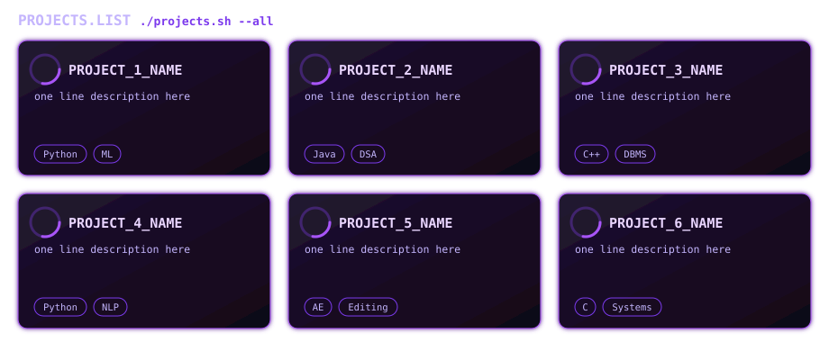

<div align="center">


</div>

<div align="center">
  
  <br/>
  <sub><i>terminal-style card — lives in <code>assets/terminal-card.svg</code>. Fields boot in line-by-line, cursor blinks forever, and the dotted face in the frame flickers on its own. Send me your photo and I'll drop it inside that frame instead of the pixel-face.</i></sub>
</div>

<br/>

<div align="center">

[](https://git.io/typing-svg)

</div>

<br/>

<p align="center">


</p>

<!-- ^ badges are plain inline images inside a centered paragraph, so they naturally reflow / wrap
     on any screen width — mobile GitHub app, tablet, or desktop — no extra CSS needed. -->

---

## `whoami`

<table>
<tr>
<td width="52%" valign="top">

```python
class QuantumSenpai:

    name     = "Krishnendu Adak"
    alias    = "kisu"
    location = "Ghatal, West Bengal 🇮🇳"
    college  = "Adamas University, Barasat"
    degree   = "B.Tech CSE — 3rd Year"
    contact  = "itxkisu@gmail.com"

    stack    = ["Java", "C", "C++", "DSA", "DBMS"]
    learning = ["Machine Learning", "NLP"]
    creative = ["After Effects", "Premiere Pro",
                "DaVinci Resolve", "Photoshop", "Canva"]

    def motto(self):
        return "Build it. Break it. Understand it. Ship it."
```

</td>
<td width="48%" valign="top">

```yaml
# runtime.config

uptime    : 24/7 ⚡
mode      : grind.exe 🎯
fuel      : chai ☕ + lo-fi 🎵
os        : human v22.0

current_tasks:
  → grinding DSA daily
  → exploring ML & NLP
  → crafting motion design

traits:
  → debugs at 2am (no cap)
  → edits like a pro editor
  → certified anime fanboy 🌸

availability: open_to_work ✅
```

</td>
</tr>
</table>

<div align="center">

*「 Build it. Break it. Understand it. Ship it. 」*

</div>

---

## `tech.stack`

<div align="center">

**Languages**


**Core CS**


**Creative Suite**


**Currently Unlocking 🔓**


</div>

---

## `projects`

<div align="center">
  
  <br/>
  <sub><i>lives in <code>assets/project-cards.svg</code> — rings spin forever (pure CSS/SMIL, no JS). Edit the 6 placeholder names/descriptions/tags directly in that file for your real repos — see chat for exactly which lines to change.</i></sub>
</div>

---

## `github.stats`

<div align="center">


&nbsp;&nbsp;


<br/><br/>


</div>

---

## `contribution.snake` 🐍

<div align="center">

<!-- this block is generated automatically by the GitHub Action in
     .github/workflows/snake.yml — the snake "eats" your real contribution
     graph every 6 hours. see setup notes below. -->
<picture>
  <source media="(prefers-color-scheme: dark)" srcset="https://raw.githubusercontent.com/QuantumSenpai/QuantumSenpai/output/github-snake-dark.svg" />
  <source media="(prefers-color-scheme: light)" srcset="https://raw.githubusercontent.com/QuantumSenpai/QuantumSenpai/output/github-snake.svg" />
  
</picture>

</div>

---

## `activity`

<div align="center">

[](https://github.com/QuantumSenpai)

</div>

---

## `trophies`

<div align="center">

[](https://github.com/QuantumSenpai)

</div>

---

## `connect`

<div align="center">

<br/>

[](mailto:itxkisu@gmail.com)
[](https://www.linkedin.com/in/krishnendu158)
[](https://instagram.com/aura4.vibes)

<!-- badges above sit in one centered paragraph with no fixed width, so on a
     narrow (mobile) screen they simply wrap to the next line — that's the
     "responsive" behaviour markdown/HTML badges give you for free. -->

<br/><br/>

</div>


